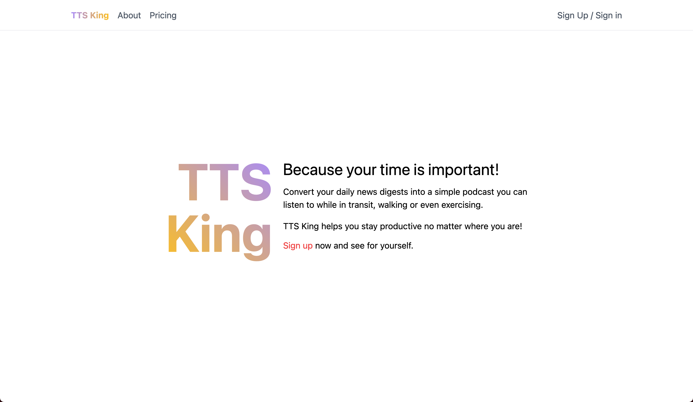

# TTS King

Convert your daily news digests into a simple podcast you can listen to
while in transit, walking or even exercising. TTS King helps you stay
productive no matter where you are!



```
UPDATE:
While I still love the idea behind this site, other priorities do not
allow me to dedicate enough time to this side project.
I may continue this project in the future, even if it would have to be
downscaled.
In either case, I have gained valuable experience even from what I have
implemented so far.
```

## Development

```zsh
npm i  # install dependencies
npm run dev  # start development server
```

This would start the development server at [http://locahlost:3000](http://locahlost:3000)

## Production

```zsh
npm i  # install dependencies
npm run build  # begin build process
npm run start  # start production server
```

This would start the production server at [http://locahlost:3000](http://locahlost:3000)

Afterwards, you can deploy this site at [https://vercel.com](https://vercel.com)

Alternatively, you can to configure a reverse proxy (e.x Nginx)
that would handle the SSL certificate and forward the requests to
port 80, which should be made externally available.
